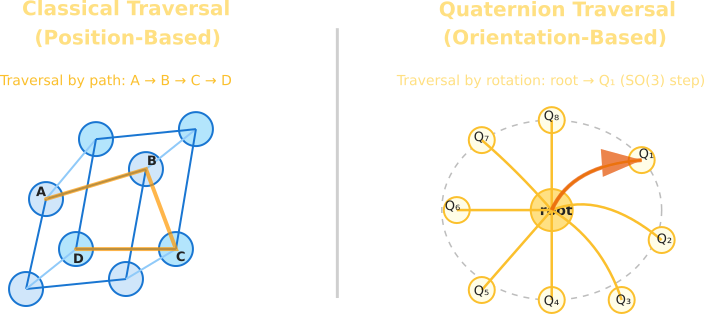

# SpinStep - [Read the Docs](https://github.com/VoxLeone/SpinStep/tree/main/docs/index.md)

**SpinStep** is a proof-of-concept quaternion-driven traversal framework for trees and orientation-based data structures.

By leveraging the power of 3D rotation math, SpinStep enables traversal based not on position or order, but on orientation. This makes it ideal for spatial reasoning, robotics, 3D scene graphs, and anywhere quaternion math naturally applies.

<div align="center">
  
</div>

---

## Features

- Quaternion-based stepping and branching  
- Full support for yaw, pitch, and roll rotations  
- Configurable angular thresholds for precision control  
- Easily extendable to N-ary trees or orientation graphs  
- Written in Python with SciPy's rotation engine  

---

## Example Use Case

```python
from spinstep import Node, QuaternionDepthIterator

# Define your tree with orientation quaternions
root = Node("root", [0, 0, 0, 1], [
    Node("child", [0.2588, 0, 0, 0.9659])  # ~30 degrees around Z
])

# Step using a 30-degree rotation
iterator = QuaternionDepthIterator(root, [0.2588, 0, 0, 0.9659])

for node in iterator:
    print("Visited:", node.name)
```

---

## Requirements

- Python 3.8+  
- `numpy`  
- `scipy`  
- `scikit-learn`
  
Install dependencies via pip:

```bash
pip install numpy scipy scikit-learn
```
## Node Requirements

- `.orientation`: Quaternion as `[x, y, z, w]`, always normalized.
- `.children`: Iterable of nodes.
- Node constructor and orientation set utilities always normalize quaternions and check for zero-norm.
- `angle_threshold` parameters are always in radians.

All core functions will raise `ValueError` or `AttributeError` if these invariants are violated.

---

## Concepts

SpinStep uses quaternion rotation to determine if a child node is reachable from a given orientation. Only children whose orientations lie within a defined angular threshold (default: 45°) of the current rotation state are traversed.

This mimics rotational motion or attention in physical and virtual spaces. Ideal for:

- Orientation trees  
- 3D pose search  
- Animation graph traversal  
- Spatial AI and robotics
---

<div align="center">
  
</div>

---

## What Would It Mean to “Rotate into Branches”?

### 1. Quaternion as a Branch Selector

- Each node in a graph or tree encodes a rotational state (quaternion)  
- Traversal is guided by a current quaternion state  
- At each step, you rotate your state and select the next node based on geometric orientation  

🔸 *Use Cases*: Scene graphs, spatial indexing, directional AI traversal, robot path planning  

---

### 2. Quaternion-Based Traversal Heuristics

Instead of:

```python
next = left or right
```

You define:

```python
next_node = rotate(current_orientation, branch_orientation)
```

- Rotation (quaternion multiplication) becomes the “step” function  
- Orientation and direction are first-class traversal parameters  

🔸 *Use Cases*: Game engines, camera control, 3D modeling, procedural generation  

---

### 3. Multi-Dimensional Trees with Quaternion Keys

- Use quaternion distance (angle) to decide which branches to explore or when to stop  
- Think of it like a quaternion-aware k-d tree  

---

### Visual Metaphor

Imagine walking through a tree **not** left/right — but by **rotating** in space:

- Rotate **pitch** to descend to one child  
- Rotate **yaw** to reach another  
- Traverse hierarchies by change in orientation, not position  

---

## Project Structure

```
spinstep/
├── __init__.py
├── discrete.py
├── discrete_iterator.py
├── node.py
├── traversal.py
└── utils/
    ├── array_backend.py
    ├── quaternion_math.py
    └── quaternion_utils.py

benchmark/
├── edge-cases.md
├── INSTRUCTIONS.md
├── qgnn_example.py
├── README.md
├── references.md
└── test_qgnn_benchmark.py

demos/
├── demo1_tree_traversal.py
├── demo2_full_depth_traversal.py
├── demo3_spatial_traversal.py
├── demo4_discrete_traversal.py
└── demo.py

examples/
└── gpu_orientation_matching.py

tests/
├── test_discrete_traversal.py
└── test_spinstep.py

docs/
├── assets/
│   ├── img/
│   │   └── (...)         # Images go here
│   └── notebooks/
│       └── (...)         # Jupyter notebooks or rendered outputs
├── CONTRIBUTING.md
└── index.md

# Root files
CHANGELOG.md
LICENSE
MANIFEST.in
pyproject.toml
README.md
requirements.txt
dev-requirements.txt
setup.cfg
setup.py
```

---

## To Build and Install Locally

First, clone the repository:

```bash
git clone https://github.com/VoxLeone/spinstep.git
cd spinstep
```

Then, install it:

```bash
pip install .
```

To build a wheel distribution:

```bash
python -m build
```
---
## [Benchmark Instructions](benchmark/INSTRUCTIONS.md)
---

## License

MIT — free to use, fork, and adapt.

## 💬 Feedback & Contributions

PRs and issues are welcome!  
If you're using SpinStep in a cool project, let us know.
