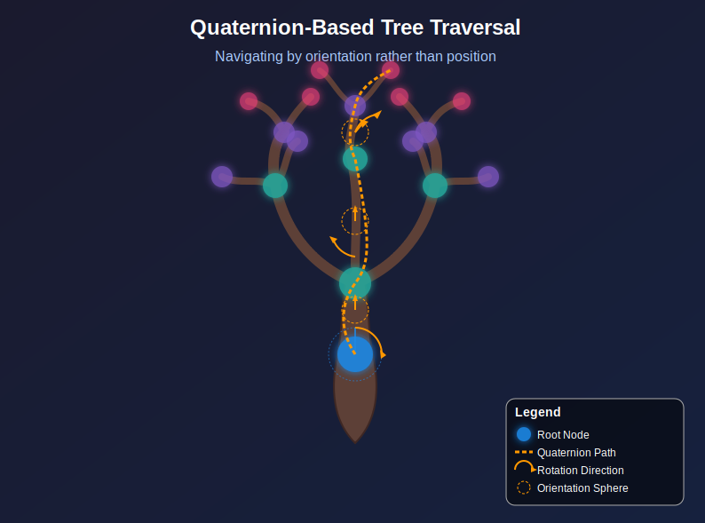

# SpinStep

**SpinStep** is a quaternion-driven traversal framework for trees and orientation-based data structures. Instead of traversing by position or order, SpinStep uses 3D rotation math to navigate trees based on orientation — making it ideal for robotics, spatial reasoning, 3D scene graphs, and anywhere quaternion math naturally applies.

<div align="center">
  
</div>

## Overview

SpinStep provides two traversal modes:

- **Continuous traversal** — apply a single rotation step at each node and visit children whose orientation falls within an angular threshold (`QuaternionDepthIterator`).
- **Discrete traversal** — try every rotation from a predefined symmetry group or custom set and visit reachable children (`DiscreteQuaternionIterator` with `DiscreteOrientationSet`).

Both modes are built on a simple `Node` class that stores a name, a unit quaternion orientation `[x, y, z, w]`, and a list of children.

## Installation

**Requirements:** Python 3.9+

Install from source:

```bash
git clone https://github.com/VoxleOne/SpinStep.git
cd SpinStep
pip install .
```

Or install in editable mode for development:

```bash
pip install -e ".[dev]"
```

## Quick Start

```python
from spinstep import Node, QuaternionDepthIterator

# Build a small tree with quaternion orientations [x, y, z, w]
root = Node("root", [0, 0, 0, 1], [
    Node("child", [0.2588, 0, 0, 0.9659])  # ~30° rotation around Z
])

# Traverse using a 30° rotation step
iterator = QuaternionDepthIterator(root, [0.2588, 0, 0, 0.9659])

for node in iterator:
    print("Visited:", node.name)
# Output:
# Visited: root
# Visited: child
```

## Core Concepts

### Node

A tree node with a quaternion-based orientation. Each node stores a name, a unit quaternion `[x, y, z, w]` (automatically normalised), and a list of children.

```python
from spinstep import Node

root = Node("root", [0, 0, 0, 1])
child = Node("child", [0, 0, 0.3827, 0.9239])  # ~45° around Z
root.children.append(child)
```

### QuaternionDepthIterator

Depth-first iterator that applies a continuous rotation step at each node. Only children within an angular threshold of the rotated state are visited.

```python
from spinstep import Node, QuaternionDepthIterator

root = Node("root", [0, 0, 0, 1], [
    Node("close", [0.2588, 0, 0, 0.9659]),   # ~30° — will be visited
    Node("far", [0.7071, 0, 0, 0.7071]),      # ~90° — too far
])

for node in QuaternionDepthIterator(root, [0.2588, 0, 0, 0.9659]):
    print(node.name)
# Output:
# root
# close
```

### DiscreteOrientationSet

A set of discrete quaternion orientations with spatial querying. Comes with factory methods for common symmetry groups.

```python
from spinstep import DiscreteOrientationSet

cube_set = DiscreteOrientationSet.from_cube()          # 24 orientations
icosa_set = DiscreteOrientationSet.from_icosahedron()   # 60 orientations
grid_set = DiscreteOrientationSet.from_sphere_grid(200) # 200 Fibonacci-sampled
```

### DiscreteQuaternionIterator

Depth-first iterator that tries every rotation in a `DiscreteOrientationSet` at each node. Children reachable by any rotation within the angular threshold are visited.

```python
import numpy as np
from spinstep import Node, DiscreteOrientationSet, DiscreteQuaternionIterator

root = Node("root", [0, 0, 0, 1], [
    Node("child1", [0, 0, 0.3827, 0.9239]),
    Node("child2", [0, 0.7071, 0, 0.7071]),
])

orientation_set = DiscreteOrientationSet.from_cube()
it = DiscreteQuaternionIterator(root, orientation_set, angle_threshold=np.pi / 4)

for node in it:
    print(node.name)
# Output:
# root
# child1
# child2
```

## Examples

### Continuous Traversal with Custom Threshold

```python
import numpy as np
from spinstep import Node, QuaternionDepthIterator

root = Node("origin", [0, 0, 0, 1], [
    Node("alpha", [0.1305, 0, 0, 0.9914]),  # ~15°
])

# Use explicit angle threshold of 20° (in radians)
it = QuaternionDepthIterator(root, [0.1305, 0, 0, 0.9914], angle_threshold=np.deg2rad(20))
print([n.name for n in it])
# Output: ['origin', 'alpha']
```

### Query Orientations by Angle

```python
import numpy as np
from spinstep import DiscreteOrientationSet

dos = DiscreteOrientationSet.from_cube()
indices = dos.query_within_angle([0, 0, 0, 1], np.deg2rad(10))
print(f"Found {len(indices)} orientations within 10° of identity")
```

## Optional Dependencies

SpinStep works out of the box with NumPy and SciPy. Two optional dependencies unlock additional features:

| Package | Install | Feature |
|---------|---------|---------|
| [CuPy](https://cupy.dev/) | `pip install cupy-cuda12x` | GPU-accelerated orientation storage and angular distance computation |
| [healpy](https://healpy.readthedocs.io/) | `pip install healpy` | HEALPix-based unique relative spin detection via `get_unique_relative_spins()` |

GPU example:

```python
import numpy as np
from spinstep import DiscreteOrientationSet

orientations = np.random.randn(1000, 4)
# Store orientations on GPU (requires CuPy)
gpu_set = DiscreteOrientationSet(orientations, use_cuda=True)
```

## Development

```bash
# Install with development dependencies
pip install -e ".[dev]"

# Run tests
python -m pytest tests/ -v

# Run linter
ruff check spinstep/
```

## Documentation

Full documentation is available in the [docs/](docs/index.md) directory:

- [Getting Started](docs/getting-started.md)
- [Continuous Traversal Guide](docs/continuous-traversal.md)
- [Discrete Traversal Guide](docs/discrete-traversal.md)
- [FAQ](docs/faq.md)
- [API Reference](docs/09-api-reference.md)
- [Contributing](docs/CONTRIBUTING.md)

## License

MIT — see [LICENSE](LICENSE) for details.
