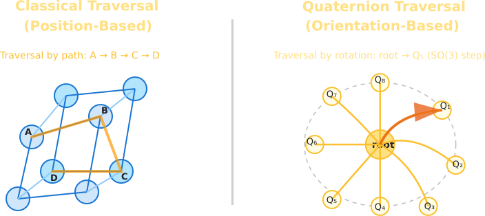

# SpinStep Traversal Framework: Navigation and Orientation on Spherical Domains

The SpinStep traversal framework concept uses quaternions to represent movement as rotations rather than positional steps.
Bellow an SVG illustration that visualizes this concept. Here's a diagram showing the difference between traditional point-to-point traversal and the quaternion-based rotational approach:

This illustration contrasts:

Left Side - Traditional Traversal:

+ Shows nodes connected in a graph structure (A, B, C, D)
+ Movement follows a position-based approach
+ Path follows linear steps from point to point
+ Traversal is determined by spatial distance between nodes

Right Side - SpinStep Quaternion Traversal:

+ Shows movement as rotations rather than steps
+ Uses a quaternion-based orientation system
+ The current orientation rotates toward the target orientation
+ Traversal selects paths based on angular proximity rather than positional distance

The key insight illustrated is that SpinStep represents a departure from thinking about traversal as "stepping from point A to B" to thinking about it as "rotating from one orientation to another" using quaternion mathematics. This creates a fundamentally different way of navigating through spaces or data structures.

## Application Domains: Orientation as Primary Constraint

**Scene Graphs**: Instead of simply tracking parent-child positional relationships, scene graph traversals could prioritize maintaining consistent relative orientations as objects move or animate. This could lead to more natural-looking interactions and transformations, particularly for complex articulated structures like character models.

**Spatial Indexing**: Traditional spatial partitioning (octrees, KD-trees) focuses on positional proximity. A quaternion-enhanced spatial index could prioritize objects with similar orientations, which would be invaluable for tasks like finding all objects "facing" a particular direction - critical for visibility determination, lighting calculations, or directional queries.

**Directional AI Traversal**: This is particularly interesting - AI agents could make decisions based not just on where to go but on how their orientation evolves. This creates a more embodied form of navigation where the rotation history influences future choices, potentially leading to more natural-looking movement patterns that respect momentum and directional intent.

**Game Engines**: Camera systems could especially benefit here. Rather than interpolating between camera positions (which often leads to unnatural movements), a quaternion approach could create cinematic camera motions that respect orientation constraints. This could solve many of the jarring transitions that plague third-person cameras when navigating complex environments.

**Procedural Generation**: Perhaps most fascinating - generative algorithms could "grow" structures by following orientation-based rules rather than positional ones. This might produce more organic-looking forms that exhibit natural flow and directional coherence, similar to how biological structures often follow directional growth patterns.

The common thread I see is that a quaternion approach inherently respects the continuity of movement and orientation in a way that discrete positional systems don't. This seems especially valuable anywhere that natural, fluid motion matters - whether that's virtual characters, cameras, or generative systems trying to mimic organic growth patterns.

## SpinStep Implications: Traversal as Transformation

#### Continuous vs. Discrete Motion
Traditional traversal frameworks are rooted in discretization — moving from node to node, frame to frame, tick to tick. These systems presume that space is best navigated via positional deltas. But quaternions encode change as continuity, not as adjacency. SpinStep, by operating within the space of orientations, implies a traversal that is inherently smooth: a progression through directional phase space rather than a hop through geometric coordinates. This reorients how we think about "path": not as a sequence of steps, but as a curve in orientation space — continuous, differentiable, and expressive.

#### Orientation Memory and Directional Inertia
A quaternion, by its nature, carries history. Not in a temporal sense, but in its embedding of rotational state. Unlike Cartesian systems, where position is a stateless point, orientation encodes a trajectory — a remembered arc of how an object has turned to face where it is. This gives rise to momentum-like behaviors: movement choices that reflect not just where one is, but where one has been aiming. Traversal, then, becomes non-Markovian; the next step depends on accumulated directional intent.

#### Dimensional Generalization
In low-dimensional Euclidean space, distance feels intuitive. But as dimensionality increases — in feature spaces, state manifolds, or latent vector embeddings — Euclidean metrics lose meaning. Angles persist. Orientation persists. SpinStep might offer a cognitive foothold in high-dimensional traversal, where rotation (i.e., relational change) is more meaningful than absolute position. Instead of navigating by proximity, systems could navigate by directional congruence in latent spaces — offering potentially more robust alignment, generalization, and interpretability.

#### Biological Alignment
Organisms — particularly those with central nervous systems — often navigate not by computing positions, but by modulating orientation. A bird doesn’t fly to a location so much as aligns itself toward a magnetic vector or a visual target. A human doesn’t plan a step as a coordinate shift, but as a reconfiguration of balance and gaze. SpinStep echoes this: a shift from Cartesian abstraction to embodied rotation. It aligns computational models with how biological systems actually move: not by stepping, but by turning.

#### Beyond Navigation: Rotational Reasoning
If traversal through space can be rotational, why not traversal through decision landscapes? SpinStep hints at a broader epistemology: exploring solution space not as a sequence of binary decisions, but as a series of angular adjustments — small reorientations of context, strategy, or interpretation. AI models might learn to “rotate through” ideas, rather than jumping discretely between options. This reframes cognition itself as a kind of traversal in orientation space — fluid, continuous, and context-sensitive.

## Computational Overhead: Cost as Commitment

It’s true — quaternion-based systems demand more. More computation, more precision, more attention to numerical stability. But what they offer in return is not just motion, but fidelity: to orientation, to continuity, to the way real-world systems behave.

#### Mathematical Complexity
Quaternion arithmetic — multiplication, normalization, slerp (spherical linear interpolation) — isn’t trivial. These operations involve more floating-point math than basic vector addition or scalar interpolation. But this added complexity is structurally meaningful: every operation preserves rotational integrity in a way that simpler methods cannot. You’re paying for conservation — of angle, of axis, of smoothness.

#### Representational Overhead
A quaternion carries four components (w, x, y, z) — a seemingly minor increase over a 3D vector, but one that compounds across millions of instances. This affects memory bandwidth, cache behavior, and processing cost. Still, the fourth dimension isn’t redundancy — it’s closure. It allows the system to model full 3D rotations without singularities or ambiguity, something Euler angles or matrices can’t guarantee without side effects.

#### Normalization Discipline
Unlike position vectors, quaternions drift under repeated operations. Normalization is required to retain unit magnitude and ensure valid rotation representations. This introduces a subtle tension: precision vs. performance. But in practice, regular normalization acts as a corrective rhythm, preserving system integrity over time. The discipline it imposes is part of the paradigm — not a bug, but a constraint that guides structure.

#### Interfacing with Legacy Systems
The real cost often lies not in using quaternions, but in translating them — to matrices for rendering, to Euler angles for UI display, to axis-angle for physics engines. These conversions aren’t free. But they're transitional. As quaternion-native thinking proliferates, more systems will internalize orientation as a first-class citizen, reducing the need for constant translation and interpolation between mismatched representations.

## Why the Cost is Not Only Worth It — But Inevitable

#### Correctness Over Shortcutting
In domains where orientation defines behavior — robotics, spacecraft, articulated motion — quaternions are not optional. They're the only mathematically consistent way to represent rotation in 3D without gimbal lock, degeneracy, or aliasing. Attempting to bypass them with cheaper abstractions invariably results in workaround-laden architectures that leak complexity at every edge.

#### Qualitative Differentiation
This isn’t just about "it works." Quaternion-based traversal feels different — smoother, more organic, less mechanical. In user-facing domains like gaming, film, and interactive design, that fluidity is a competitive edge. The difference between “passable” and “compelling” often lies in micro-movements — the tiny rotational consistencies that the human brain picks up, consciously or not.

#### Hardware Trends Favor Rotation
Modern GPUs and vectorized CPU instruction sets increasingly support the kinds of operations quaternion math relies on. What was once an overhead is now often parallelized, pipelined, and shader-accelerated. In practice, we’re approaching an inflection point where rotation-native computation becomes more performant than hacked-together approximations built on positional deltas.

#### Algorithmic Leverage
Though each quaternion operation may be more expensive, systems using them often converge faster or need fewer steps. Orientation-aware traversal reduces oscillations, eliminates redundant movement, and minimizes edge cases. What you spend on math, you save on debugging, patching, and iterating.

    So the calculus changes:
    The question is no longer “Can we afford quaternions?”
    It becomes: “Can we afford the long-term cost of avoiding them?”

Quaternions introduce complexity, yes — but it’s principled complexity, embedded at the level where the problem lives. It's not scaffolding for a broken abstraction, but the correct geometry for the task. And as your system scales, that correctness compounds — into elegance, into robustness, into longevity.

### Guidance Systems: Rotation as the Native Language of Control

SpinStep’s strength is not merely in metaphor or modeling — it directly aligns with how guided systems, from drones to spacecraft, *actually move*. Position is an outcome; **orientation is the actuator**. Most guided platforms — physical or virtual — interact with the world not by teleportation or absolute repositioning, but by continuous turning, steering, slewing. Quaternions are not an abstraction layered on top of this reality — they are its **mathematical substrate**.

**Rocket and Drone Guidance**
Traditional waypoint navigation assumes movement through a series of Cartesian positions. But in pursuit dynamics, for example, what matters is *directional alignment over time*. SpinStep enables a guidance system to treat interception as a problem of rotational convergence — adjusting pitch, yaw, and roll via smooth quaternion interpolation. This creates more efficient intercept paths, reduces control surface oscillations, and respects the vehicle’s rotational constraints. In essence, the path is not plotted — it is **oriented into**.

**Autonomous Vehicles**
While autonomous navigation pipelines often emphasize obstacle maps and shortest paths, vehicle control is ultimately a problem of orientation: steering angles, curvature constraints, body roll. A quaternion-based traversal engine could reframe route planning around **minimally disruptive orientation flows**, producing routes that feel more human, less mechanical. Particularly in passenger-facing contexts, this shift matters: smoothness is not cosmetic, it’s **experiential fidelity**.

**Spacecraft Attitude Control**
Here, the fit is almost tautological. Quaternions are already the de facto standard for modeling spacecraft attitude — not just because they work, but because they’re **necessary**. SpinStep builds upon this base, offering not just a representation of rotation, but a **strategy for traversing orientation space efficiently**. Trajectories can be optimized for minimal angular velocity changes, fuel-efficient control sequences, and avoidance of unstable orientations. This isn’t just simulation; it’s mission-critical optimization.

**Robotic Arm Kinematics**
Industrial and service robots often work in confined spaces where joint limits and torque loads make positional paths brittle. Planning motions as orientation-first sequences allows for smoother toolpaths and **less wear on joints**, as systems avoid “contorting” into position and instead **flow** through rotations. Quaternion interpolation reduces jerk, minimizes singularities, and ensures the end-effector arrives not just at the correct location, but facing the right way, with the right continuity of motion.

**Human Motion Guidance**
Whether in rehabilitation, fitness, or sports training, guiding human movement through orientation change — rather than positional targets — aligns with how bodies actually operate. A joint moves not to a coordinate, but through an **arc**. SpinStep could underlie systems that guide users through spatial motions by shaping their rotational trajectories: suggesting the *way to turn*, not just *where to go*. This results in motion feedback that is less rigid, more embodied — more *intuitive to follow* because it resonates with the body’s natural semantics.

### Guidance as Traversal in Orientation Space

What unites these systems is a core insight: **they do not move by translating in space — they move by turning into alignment with objectives**. SpinStep abstracts this common structure into a navigational framework grounded in quaternion logic. In doing so, it doesn’t just model guidance — it **becomes it**.

> The elegance lies in congruence:
> the algorithm traverses orientation space
> exactly as the system it governs does.

From line-of-sight intercepts to cinematic camera cuts, from spacecraft docking to expressive animation arcs — **SpinStep operationalizes the rotational grammar of complex systems**.

## Closing Synthesis: Traversal Reframed as Rotational Semantics

SpinStep is not a novel data structure or an optimization heuristic. It is a change in the unit of traversal — from positional increment to rotational progression. This reframing has cascading effects. It alters how we model motion, how we think about proximity, and ultimately how systems relate to space itself.

The traditional metaphor of movement — stepping from point A to point B — is spatially intuitive but semantically impoverished. It ignores the continuity of direction, the embodiment of motion, and the nontriviality of turning. Quaternion-based traversal reintroduces these elements. It is not just more precise; it is more faithful to the mechanisms by which physical and virtual entities evolve through space.

By recasting traversal as rotation:

+Continuity becomes primary, rather than incidental.
+Orientation becomes stateful, not just representational.
+Paths become expressive, encoding not just endpoints but the transitions between them.

This has implications beyond navigation:

+In perception: systems that prioritize what they are facing, not just where they are.

+In planning: agents that evolve strategies by rotating through configurations, not leaping across them.

+In representation: spaces where orientation is the organizing axis — not as metadata, but as structure.

The choice to use quaternions is not a stylistic one. It is a geometric commitment — to treat rotation not as a byproduct of movement, but as its medium. This commitment introduces overhead, yes, but it also removes distortions that simpler abstractions introduce — distortions that grow more costly as systems scale or become embodied.

What SpinStep proposes is not a solution to a problem, but a recasting of the problem space itself. Where traversal is no longer a matter of “going to,” but of “becoming aligned with.” This is not a metaphor; it is a change in representational substrate — and as such, it rewrites what the system can perceive, express, and achieve.
