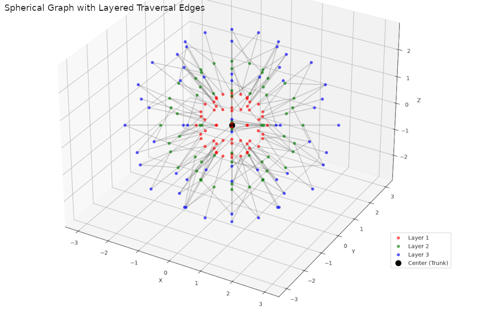

# Visualization

Example of concentric spherical graph with **edges** and a possible **traversal visualization**.  We can:

1. **Connect each node to the trunk** (center node),
2. **Connect nodes between layers** (e.g., closest node in next layer),
3. Optionally **animate a traversal**, like BFS or DFS.

---



---

Here's the code that adds edges from each node to the center and to corresponding nodes on adjacent layers for a visual traversal structure:

```python
import numpy as np
import matplotlib.pyplot as plt
from mpl_toolkits.mplot3d import Axes3D
from scipy.spatial import cKDTree

def generate_sphere_nodes(num_lat, num_lon, radius=1.0):
    nodes = []
    for i in range(1, num_lat):  # avoid poles for simplicity
        theta = np.pi * i / num_lat
        z = radius * np.cos(theta)
        r_xy = radius * np.sin(theta)
        for j in range(num_lon):
            phi = 2 * np.pi * j / num_lon
            x = r_xy * np.cos(phi)
            y = r_xy * np.sin(phi)
            nodes.append((x, y, z))
    return np.array(nodes)

def connect_layers(src, dst, k=2):
    """Connect each node in src to its k nearest neighbors in dst."""
    tree = cKDTree(dst)
    connections = []
    for pt in src:
        dists, idxs = tree.query(pt, k=k)
        idxs = [idxs] if np.isscalar(idxs) else idxs
        for i in idxs:
            connections.append((pt, dst[i]))
    return connections

# Parameters
radii = [1, 2, 3]
num_lat, num_lon = 6, 12
colors = ['r', 'g', 'b']
all_nodes = []
all_edges = []

# Create nodes and connect layers
for idx, r in enumerate(radii):
    nodes = generate_sphere_nodes(num_lat, num_lon, radius=r)
    all_nodes.append(nodes)

# Connect central trunk to first layer
trunk = np.array([[0, 0, 0]])
first_layer = all_nodes[0]
edges = connect_layers(trunk, first_layer, k=3)
all_edges.extend(edges)

# Connect adjacent layers
for i in range(len(all_nodes) - 1):
    src = all_nodes[i]
    dst = all_nodes[i + 1]
    edges = connect_layers(src, dst, k=2)
    all_edges.extend(edges)

# Plot
fig = plt.figure(figsize=(12, 10))
ax = fig.add_subplot(111, projection='3d')

# Plot nodes
for idx, nodes in enumerate(all_nodes):
    xs, ys, zs = nodes[:, 0], nodes[:, 1], nodes[:, 2]
    ax.scatter(xs, ys, zs, color=colors[idx], label=f'Layer {idx+1}', alpha=0.6)

# Plot trunk
ax.scatter(0, 0, 0, color='k', s=100, label='Center (Trunk)')

# Plot edges
for a, b in all_edges:
    ax.plot([a[0], b[0]], [a[1], b[1]], [a[2], b[2]], color='gray', alpha=0.4)

ax.set_title("Spherical Graph with Layered Traversal Edges")
ax.set_xlabel("X")
ax.set_ylabel("Y")
ax.set_zlabel("Z")
ax.legend()
plt.tight_lawet()
plt.show()

```

### Output:

* **Edges to the center**: Simulates tree "roots" from outer nodes.
* **Edges between layers**: Simulates upward traversal or graph expansion.
* Light `alpha` values keep the plot readable even with many lines.

---

### Animated Traversal of Spherical Graph

```python
import numpy as np
import matplotlib.pyplot as plt
from matplotlib import animation
from mpl_toolkits.mplot3d import Axes3D
from scipy.spatial import cKDTree

def generate_sphere_nodes(num_lat, num_lon, radius=1.0):
    nodes = []
    for i in range(1, num_lat):
        theta = np.pi * i / num_lat
        z = radius * np.cos(theta)
        r_xy = radius * np.sin(theta)
        for j in range(num_lon):
            phi = 2 * np.pi * j / num_lon
            x = r_xy * np.cos(phi)
            y = r_xy * np.sin(phi)
            nodes.append((x, y, z))
    return np.array(nodes)

def connect_layers(src, dst, k=2):
    tree = cKDTree(dst)
    connections = []
    for pt in src:
        dists, idxs = tree.query(pt, k=k)
        idxs = [idxs] if np.isscalar(idxs) else idxs
        for i in idxs:
            connections.append((pt, dst[i]))
    return connections

# Generate nodes and edges
radii = [1, 2, 3]
num_lat, num_lon = 6, 12
colors = ['r', 'g', 'b']
all_nodes, all_edges = [], []

for r in radii:
    nodes = generate_sphere_nodes(num_lat, num_lon, radius=r)
    all_nodes.append(nodes)

trunk = np.array([[0, 0, 0]])
first_layer = all_nodes[0]
edges = connect_layers(trunk, first_layer, k=3)
all_edges.extend(edges)

for i in range(len(all_nodes) - 1):
    src, dst = all_nodes[i], all_nodes[i + 1]
    edges = connect_layers(src, dst, k=2)
    all_edges.extend(edges)

# Set up 3D plot
fig = plt.figure(figsize=(12, 10))
ax = fig.add_subplot(111, projection='3d')
for idx, nodes in enumerate(all_nodes):
    xs, ys, zs = nodes[:, 0], nodes[:, 1], nodes[:, 2]
    ax.scatter(xs, ys, zs, color=colors[idx], label=f'Layer {idx+1}', alpha=0.6)
ax.scatter(0, 0, 0, color='k', s=100, label='Center (Trunk)')
ax.set_xlim([-3.5, 3.5])
ax.set_ylim([-3.5, 3.5])
ax.set_zlim([-3.5, 3.5])
ax.set_title("Animated Traversal of Spherical Graph")
ax.set_xlabel("X")
ax.set_ylabel("Y")
ax.set_zlabel("Z")
ax.legend()

# Animation logic
lines = []
def init():
    return lines

def animate(i):
    if i < len(all_edges):
        a, b = all_edges[i]
        line, = ax.plot([a[0], b[0]], [a[1], b[1]], [a[2], b[2]], color='orange', lw=2)
        lines.append(line)
    return lines

ani = animation.FuncAnimation(fig, animate, frames=len(all_edges), init_func=init,
                              interval=100, blit=False, repeat=False)

# To display in Jupyter Notebook:
from IPython.display import HTML
HTML(ani.to_jshtml())
```

---

**Tip**: we can also export it as a `.mp4` or `.gif` by using:

```python
ani.save("spherical_traversal.mp4", writer="ffmpeg", fps=10)
```
---
[⬅️ 04. Use Cases](04-use-cases.md) | [🏠 Home](index.md) | [06. Discrete Traversal ➡️](06-discrete-traversal.md)
