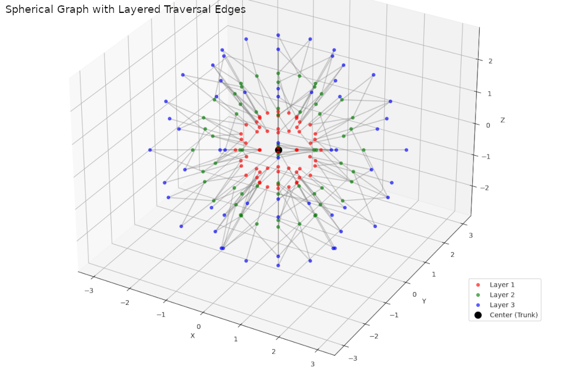

# Visualization

Example of concentric spherical graph with **edges** and a possible **traversal visualization**.  We can:

1. **Connect each node to the trunk** (center node),
2. **Connect nodes between layers** (e.g., closest node in next layer),
3. Optionally **animate a traversal**, like BFS or DFS.

---



---

Here's the code that adds edges from each node to the center and to corresponding nodes on adjacent layers for a visual traversal structure:

```python
import numpy as np
import matplotlib.pyplot as plt
from mpl_toolkits.mplot3d import Axes3D
from scipy.spatial import cKDTree

def generate_sphere_nodes(num_lat, num_lon, radius=1.0):
    nodes = []
    for i in range(1, num_lat):  # avoid poles for simplicity
        theta = np.pi * i / num_lat
        z = radius * np.cos(theta)
        r_xy = radius * np.sin(theta)
        for j in range(num_lon):
            phi = 2 * np.pi * j / num_lon
            x = r_xy * np.cos(phi)
            y = r_xy * np.sin(phi)
            nodes.append((x, y, z))
    return np.array(nodes)

def connect_layers(src, dst, k=2):
    """Connect each node in src to its k nearest neighbors in dst."""
    tree = cKDTree(dst)
    connections = []
    for pt in src:
        dists, idxs = tree.query(pt, k=k)
        idxs = [idxs] if np.isscalar(idxs) else idxs
        for i in idxs:
            connections.append((pt, dst[i]))
    return connections

# Parameters
radii = [1, 2, 3]
num_lat, num_lon = 6, 12
colors = ['r', 'g', 'b']
all_nodes = []
all_edges = []

# Create nodes and connect layers
for idx, r in enumerate(radii):
    nodes = generate_sphere_nodes(num_lat, num_lon, radius=r)
    all_nodes.append(nodes)

# Connect central trunk to first layer
trunk = np.array([[0, 0, 0]])
first_layer = all_nodes[0]
edges = connect_layers(trunk, first_layer, k=3)
all_edges.extend(edges)

# Connect adjacent layers
for i in range(len(all_nodes) - 1):
    src = all_nodes[i]
    dst = all_nodes[i + 1]
    edges = connect_layers(src, dst, k=2)
    all_edges.extend(edges)

# Plot
fig = plt.figure(figsize=(12, 10))
ax = fig.add_subplot(111, projection='3d')

# Plot nodes
for idx, nodes in enumerate(all_nodes):
    xs, ys, zs = nodes[:, 0], nodes[:, 1], nodes[:, 2]
    ax.scatter(xs, ys, zs, color=colors[idx], label=f'Layer {idx+1}', alpha=0.6)

# Plot trunk
ax.scatter(0, 0, 0, color='k', s=100, label='Center (Trunk)')

# Plot edges
for a, b in all_edges:
    ax.plot([a[0], b[0]], [a[1], b[1]], [a[2], b[2]], color='gray', alpha=0.4)

ax.set_title("Spherical Graph with Layered Traversal Edges")
ax.set_xlabel("X")
ax.set_ylabel("Y")
ax.set_zlabel("Z")
ax.legend()
plt.tight_layout()
plt.show()

```

### Output:

* **Edges to the center**: Simulates tree "roots" from outer nodes.
* **Edges between layers**: Simulates upward traversal or graph expansion.
* Light `alpha` values keep the plot readable even with many lines.

---

### 🌀 Animated Traversal of Spherical Graph

```python
import numpy as np
import matplotlib.pyplot as plt
from matplotlib import animation
from mpl_toolkits.mplot3d import Axes3D
from scipy.spatial import cKDTree

def generate_sphere_nodes(num_lat, num_lon, radius=1.0):
    nodes = []
    for i in range(1, num_lat):
        theta = np.pi * i / num_lat
        z = radius * np.cos(theta)
        r_xy = radius * np.sin(theta)
        for j in range(num_lon):
            phi = 2 * np.pi * j / num_lon
            x = r_xy * np.cos(phi)
            y = r_xy * np.sin(phi)
            nodes.append((x, y, z))
    return np.array(nodes)

def connect_layers(src, dst, k=2):
    tree = cKDTree(dst)
    connections = []
    for pt in src:
        dists, idxs = tree.query(pt, k=k)
        idxs = [idxs] if np.isscalar(idxs) else idxs
        for i in idxs:
            connections.append((pt, dst[i]))
    return connections

# Generate nodes and edges
radii = [1, 2, 3]
num_lat, num_lon = 6, 12
colors = ['r', 'g', 'b']
all_nodes, all_edges = [], []

for r in radii:
    nodes = generate_sphere_nodes(num_lat, num_lon, radius=r)
    all_nodes.append(nodes)

trunk = np.array([[0, 0, 0]])
first_layer = all_nodes[0]
edges = connect_layers(trunk, first_layer, k=3)
all_edges.extend(edges)

for i in range(len(all_nodes) - 1):
    src, dst = all_nodes[i], all_nodes[i + 1]
    edges = connect_layers(src, dst, k=2)
    all_edges.extend(edges)

# Set up 3D plot
fig = plt.figure(figsize=(12, 10))
ax = fig.add_subplot(111, projection='3d')
for idx, nodes in enumerate(all_nodes):
    xs, ys, zs = nodes[:, 0], nodes[:, 1], nodes[:, 2]
    ax.scatter(xs, ys, zs, color=colors[idx], label=f'Layer {idx+1}', alpha=0.6)
ax.scatter(0, 0, 0, color='k', s=100, label='Center (Trunk)')
ax.set_xlim([-3.5, 3.5])
ax.set_ylim([-3.5, 3.5])
ax.set_zlim([-3.5, 3.5])
ax.set_title("Animated Traversal of Spherical Graph")
ax.set_xlabel("X")
ax.set_ylabel("Y")
ax.set_zlabel("Z")
ax.legend()

# Animation logic
lines = []
def init():
    return lines

def animate(i):
    if i < len(all_edges):
        a, b = all_edges[i]
        line, = ax.plot([a[0], b[0]], [a[1], b[1]], [a[2], b[2]], color='orange', lw=2)
        lines.append(line)
    return lines

ani = animation.FuncAnimation(fig, animate, frames=len(all_edges), init_func=init,
                              interval=100, blit=False, repeat=False)

# To display in Jupyter Notebook:
from IPython.display import HTML
HTML(ani.to_jshtml())
```

---

📌 **Tip**: You can also export it as a `.mp4` or `.gif` by using:

```python
ani.save("spherical_traversal.mp4", writer="ffmpeg", fps=10)
```
---
Let's extend the previous spherical graph example with:

#### 1. Tangential Connections

We'll connect each node to a few nearest neighbors on the same layer, simulating movement along the sphere's surface.

#### 2. Traversal Logic

We’ll implement a breadth-first search (BFS) from the center to any node, using both radial and tangential connections.

Here's the complete code with both features included:

```python

import numpy as np
from scipy.spatial.transform import Rotation as R
from collections import defaultdict, deque
import matplotlib.pyplot as plt

def fibonacci_sphere(samples=100, radius=1.0):
    points = []
    offset = 2.0 / samples
    increment = np.pi * (3.0 - np.sqrt(5.0))
    for i in range(samples):
        y = ((i * offset) - 1) + (offset / 2)
        r = np.sqrt(1 - y * y)
        phi = ((i % samples) * increment) % (2 * np.pi)
        x = np.cos(phi) * r
        z = np.sin(phi) * r
        points.append((radius * x, radius * y, radius * z))
    return np.array(points)

def build_graph_with_tangents(num_layers=3, nodes_per_layer=100, radius_step=1.0, k_tangent=3):
    graph = defaultdict(list)
    positions = {}

    # Generate layers
    layer_nodes = {}
    for layer in range(num_layers):
        r = (layer + 1) * radius_step
        nodes = fibonacci_sphere(samples=nodes_per_layer, radius=r)
        layer_nodes[layer] = []
        for idx, pos in enumerate(nodes):
            node_id = f"L{layer}_N{idx}"
            positions[node_id] = pos
            layer_nodes[layer].append(node_id)

    # Build edges: radial + tangential
    for layer in range(num_layers):
        for i, node_id in enumerate(layer_nodes[layer]):
            pos = positions[node_id]

            # Radial: connect to nearest node in layer-1
            if layer > 0:
                prev_ids = layer_nodes[layer - 1]
                closest = min(prev_ids, key=lambda nid: np.linalg.norm(positions[nid] - pos))
                graph[node_id].append(closest)
                graph[closest].append(node_id)

            # Tangential: connect to k nearest on same layer
            others = layer_nodes[layer][:i] + layer_nodes[layer][i+1:]
            dists = sorted([(nid, np.linalg.norm(positions[nid] - pos)) for nid in others], key=lambda x: x[1])
            for nid, _ in dists[:k_tangent]:
                graph[node_id].append(nid)
                graph[nid].append(node_id)

    return graph, positions

def bfs(graph, start, goal):
    """Breadth-first search to find shortest path from start to goal."""
    visited = set()
    queue = deque([(start, [start])])
    while queue:
        current, path = queue.popleft()
        if current == goal:
            return path
        if current in visited:
            continue
        visited.add(current)
        for neighbor in graph[current]:
            if neighbor not in visited:
                queue.append((neighbor, path + [neighbor]))
    return None

# --- Build and visualize the graph ---
graph, positions = build_graph_with_tangents(num_layers=3, nodes_per_layer=50, radius_step=1.0, k_tangent=3)

# Pick a path from center outward
start_node = 'L0_N0'
end_node = 'L2_N10'
path = bfs(graph, start_node, end_node)

# --- Plotting ---
fig = plt.figure(figsize=(10, 8))
ax = fig.add_subplot(111, projection='3d')

# Plot all nodes
for node_id, pos in positions.items():
    ax.scatter(*pos, s=8, color='b', alpha=0.4)

# Plot all edges
for node_id, neighbors in graph.items():
    for neighbor in neighbors:
        p1, p2 = positions[node_id], positions[neighbor]
        ax.plot([p1[0], p2[0]], [p1[1], p2[1]], [p1[2], p2[2]], color='gray', linewidth=0.3, alpha=0.3)

# Highlight path
if path:
    for i in range(len(path) - 1):
        p1, p2 = positions[path[i]], positions[path[i+1]]
        ax.plot([p1[0], p2[0]], [p1[1], p2[1]], [p1[2], p2[2]], color='red', linewidth=2)
    for node in path:
        ax.scatter(*positions[node], color='red', s=20)

ax.set_title(f"3D Spherical Graph with Radial + Tangential Connections\nPath: {start_node} → {end_node}")
ax.set_xlabel("X")
ax.set_ylabel("Y")
ax.set_zlabel("Z")
plt.tight_layout()
plt.show()
```

### What This Does:

Builds a 3-layer spherical graph.

Each node connects:

Radially (to nearest in previous layer)

Tangentially (to 3 nearest neighbors on same layer)

Performs BFS to find a path from an inner node to an outer node.

Visualizes the graph in 3D, with the shortest path highlighted in red.
        x = np.cos(phi) * r
        z = np.sin(phi) * r
        points.append((radius * x, radius * y, radius * z))
    return np.array(points)

def build_graph_with_tangents(num_layers=3, nodes_per_layer=100, radius_step=1.0, k_tangent=3):
    graph = defaultdict(list)
    positions = {}

    # Generate layers
    layer_nodes = {}
    for layer in range(num_layers):
        r = (layer + 1) * radius_step
        nodes = fibonacci_sphere(samples=nodes_per_layer, radius=r)
        layer_nodes[layer] = []
        for idx, pos in enumerate(nodes):
            node_id = f"L{layer}_N{idx}"
            positions[node_id] = pos
            layer_nodes[layer].append(node_id)

    # Build edges: radial + tangential
    for layer in range(num_layers):
        for i, node_id in enumerate(layer_nodes[layer]):
            pos = positions[node_id]

            # Radial: connect to nearest node in layer-1
            if layer > 0:
                prev_ids = layer_nodes[layer - 1]
                closest = min(prev_ids, key=lambda nid: np.linalg.norm(positions[nid] - pos))
                graph[node_id].append(closest)
                graph[closest].append(node_id)

            # Tangential: connect to k nearest on same layer
            others = layer_nodes[layer][:i] + layer_nodes[layer][i+1:]
            dists = sorted([(nid, np.linalg.norm(positions[nid] - pos)) for nid in others], key=lambda x: x[1])
            for nid, _ in dists[:k_tangent]:
                graph[node_id].append(nid)
                graph[nid].append(node_id)

    return graph, positions

def bfs(graph, start, goal):
    """Breadth-first search to find shortest path from start to goal."""
    visited = set()
    queue = deque([(start, [start])])
    while queue:
        current, path = queue.popleft()
        if current == goal:
            return path
        if current in visited:
            continue
        visited.add(current)
        for neighbor in graph[current]:
            if neighbor not in visited:
                queue.append((neighbor, path + [neighbor]))
    return None

# --- Build and visualize the graph ---
graph, positions = build_graph_with_tangents(num_layers=3, nodes_per_layer=50, radius_step=1.0, k_tangent=3)

# Pick a path from center outward
start_node = 'L0_N0'
end_node = 'L2_N10'
path = bfs(graph, start_node, end_node)

# --- Plotting ---
fig = plt.figure(figsize=(10, 8))
ax = fig.add_subplot(111, projection='3d')

# Plot all nodes
for node_id, pos in positions.items():
    ax.scatter(*pos, s=8, color='b', alpha=0.4)

# Plot all edges
for node_id, neighbors in graph.items():
    for neighbor in neighbors:
        p1, p2 = positions[node_id], positions[neighbor]
        ax.plot([p1[0], p2[0]], [p1[1], p2[1]], [p1[2], p2[2]], color='gray', linewidth=0.3, alpha=0.3)

# Highlight path
if path:
    for i in range(len(path) - 1):
        p1, p2 = positions[path[i]], positions[path[i+1]]
        ax.plot([p1[0], p2[0]], [p1[1], p2[1]], [p1[2], p2[2]], color='red', linewidth=2)
    for node in path:
        ax.scatter(*positions[node], color='red', s=20)

ax.set_title(f"3D Spherical Graph with Radial + Tangential Connections\nPath: {start_node} → {end_node}")
ax.set_xlabel("X")
ax.set_ylabel("Y")
ax.set_zlabel("Z")
plt.tight_layout()
plt.show()
```

### 🔍 What This Does:

Builds a 3-layer spherical graph.

Each node connects:

Radially (to nearest in previous layer)

Tangentially (to 3 nearest neighbors on same layer)

Performs BFS to find a path from an inner node to an outer node.

Visualizes the graph in 3D, with the shortest path highlighted in red.

---
  
## Adding a third dimension - FS Analogy

In the SpinStep traversal framework, where movement is represented as rotations using quaternions rather than positional steps, a file system modeled as a concentric spherical graph introduces a unique analogy for a "directory." Let’s address the equivalent of a directory in this context, considering the provided code and visualization.

### Analogy of a Directory in a Spherical Graph File System
In a traditional file system, a directory is a container that organizes files and other directories, forming a hierarchical structure. In a spherical graph where nodes are arranged on concentric spheres (layers) and connected to a central "trunk" node and adjacent layers, the equivalent of a directory could be conceptualized as:

1. **A Layer (Sphere) as a Directory**:
   - Each concentric sphere (defined by a radius in the code) can represent a directory. Nodes on a given sphere are analogous to files or subdirectories within that directory.
   - The radius of the sphere corresponds to the "depth" or level in the hierarchy, with inner spheres representing higher-level directories and outer spheres representing nested subdirectories.
   - For example, in the code, `radii = [1, 2, 3]` defines three layers. The sphere at radius 1 could be the root directory, radius 2 a subdirectory, and radius 3 a further nested subdirectory.

2. **A Node Cluster or Sector as a Directory**:
   - Alternatively, a directory could be a subset of nodes on a sphere, grouped by their angular coordinates (e.g., a sector defined by ranges of theta and phi in the `generate_sphere_nodes` function). This is akin to partitioning a directory into subfolders based on some criterion.
   - For instance, nodes with similar longitude (phi) values could represent files grouped under a common directory, with edges connecting them to indicate relationships.

3. **The Trunk Connection as a Directory Reference**:
   - Since each node is connected to the central trunk (as implemented in the code with edges drawn to the center `[0, 0, 0]`), the trunk could represent the root of the file system. A directory might then be defined as a collection of nodes that share a common path back to the trunk, with the path encoded as a sequence of rotations (quaternions).
   - Traversing from a node to the trunk and then to another node on a different layer mimics navigating up to a parent directory and down to a subdirectory.

4. **Quaternion-Based Traversal as Directory Navigation**:
   - In SpinStep, movement is a rotation defined by quaternions. A directory could be analogous to a "rotational context" — a set of nodes reachable by applying a specific sequence of rotations from the trunk or another reference node.
   - For example, navigating to a directory might involve rotating from the trunk to a node on a sphere (e.g., a specific theta/phi coordinate) and then exploring connected nodes on that sphere or the next layer, as shown in the code’s inter-layer edges.

### Mapping to the Code and Visualization
The provided code generates a spherical graph with:
- **Nodes** on concentric spheres at radii `[1, 2, 3]`, created using `generate_sphere_nodes`.
- **Edges** connecting each node to the trunk (center) and to corresponding nodes in adjacent layers.
- **Visualization** showing nodes as scattered points and edges as lines, with different colors for each layer.

In this structure:
- **Directory as a Sphere**: Each sphere (e.g., radius 1, 2, or 3) could be a directory. The nodes on the sphere are files or subdirectories, and edges to the trunk represent the path to the root. Inter-layer edges (e.g., from radius 1 to radius 2) represent navigation to a subdirectory.
- **Traversal**: A traversal like BFS or DFS, as mentioned, could simulate navigating the file system. For example:
  - **BFS** might explore all nodes (files) on the current sphere (directory) before moving to the next sphere (subdirectory) via inter-layer edges.
  - **DFS** might follow a path from the trunk to a node, then to a connected node on the next layer, diving deeper into the hierarchy.
- **Quaternion Representation**: Each edge traversal could be encoded as a quaternion rotation. For instance, moving from the trunk to a node at `(x, y, z)` on radius 1 involves a rotation defined by the node’s spherical coordinates (theta, phi). Moving to the next layer (radius 2) involves an additional rotation, scaling the radius while adjusting angular positions.
### Example: Directory Navigation in the Graph
Suppose the trunk is the root directory (`/`), and the sphere at radius 1 is a directory `/home`. Nodes on this sphere are files or subdirectories (e.g., `/home/user1`, `/home/user2`). The sphere at radius 2 might represent `/home/user1/docs`, with nodes as files like `doc1.txt`, `doc2.txt`.

- **Navigating to `/home`**:
  - Start at the trunk (center).
  - Apply a quaternion rotation to reach a node on the radius 1 sphere (e.g., a node at theta = π/3, phi = π/2).
- **Navigating to `/home/user1/docs`**:
  - From the node on radius 1, follow an inter-layer edge to a corresponding node on the radius 2 sphere (as coded in the loop connecting `inner_layer` to `outer_layer`).
  - This traversal is a rotation that scales the radius and adjusts the angular position.
- **Listing Files**:
  - Explore all nodes on the radius 2 sphere (e.g., using BFS to visit all nodes at that level).
- **Returning to Root**:
  - Follow the edge back to the trunk (a rotation reversing the path to the center).

### Animation of Traversal
The code could be extended to animate traversal (e.g., BFS or DFS):
- **BFS Animation**: Highlight nodes on one sphere at a time, then move to the next sphere, visualizing the exploration of directories layer by layer.
- **DFS Animation**: Trace a path from the trunk to a node, then to a connected node on the next layer, diving deeper, and backtrack to explore other branches.
- Use Matplotlib’s `FuncAnimation` to update the plot, highlighting visited nodes and edges in sequence.

### Challenges and Considerations
- **Node-to-File Mapping**: In a real file system, files have names and metadata. You’d need a way to map nodes (defined by `(x, y, z)`) to file names, perhaps using a dictionary or metadata stored at each node.
- **Quaternion Precision**: Since SpinStep uses quaternions, traversals must account for numerical precision in rotations to avoid drift when navigating between nodes.
- **Scalability**: The code generates a fixed number of nodes per sphere (`num_lat * num_lon`). A real file system might require dynamic node creation as files are added.

### Wrap-up
In a spherical graph file system using the SpinStep framework:
- A **directory** is analogous to a **concentric sphere** (e.g., radius 1 = `/home`, radius 2 = `/home/user1/docs`) or a **sector of nodes** on a sphere grouped by angular coordinates.
- **Nodes** on a sphere represent files or subdirectories.
- **Edges** to the trunk represent paths to the root, and inter-layer edges represent navigation to subdirectories.
- **Traversal** (e.g., BFS or DFS) mimics exploring directories, with each step encoded as a quaternion rotation.
- The provided code visualizes this structure, with spheres as directories, nodes as files, and edges as navigational paths. Extend it with animations or metadata to simulate file system operations.
